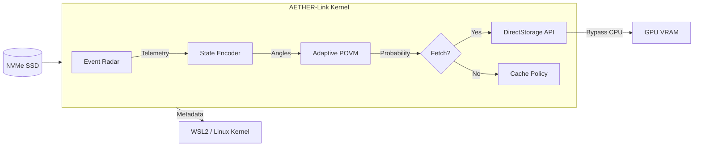

# AETHER-Link: Super-Kernel for Adaptive Sparse I/O

> **"Predicting the future is easier when you control the timeline."**

## 🚀 The Mission
**AETHER-Link** is an experimental I/O bridge designed to bypass legacy OS bottlenecks in **Microsoft WSL2** and **DirectStorage** pipelines. By leveraging **Adaptive POVM (Positive Operator-Valued Measure)** logic and **Chebyshev Proxy Metrics**, this kernel predicts and fetches data blocks for high-performance GPU workloads (LLMs, Gaming Engines) *before the OS even issues the request*.

**Target**: >2x Speedup over standard NVMe I/O in WSL2.
**Status**: Pre-Alpha (Core Logic Benchmarked at ~18ns).

---

## ⚡ The Algorithm: "Quantum-Probabilistic Prefetching"

Traditional prefetchers rely on simple strides or LRU caches. AETHER-Link treats I/O requests as a quantum system observation.

### 1. The "Event Radar" (Feature Extraction)
We don't just look at the Logical Block Address (LBA). We extract a 6D feature vector from the I/O stream in sub-nanosecond time:
*   **$\Delta$ (Delta)**: Spatial locality deviation.
*   **$V$ (Velocity)**: Acceleration of read head movement.
*   **$\sigma^2$ (Variance)**: Entropy of the request pattern.
*   **$C$ (Chebyshev Proxy)**: Spectral prediction of the next "hot" block.

### 2. Adaptive POVM Decision Gate
Instead of hard-coded thresholds, we use a dynamic "Governor" based on quantum measurement theory:
*   The system maintains internal states $\phi$ (Basis) and $\epsilon$ (Threshold).
*   Incoming telemetry is mapped to a simulated "Quantum State".
*   We simulate an observable measurement $\langle O \rangle$.
*   **Feedback Loop**: The measurement *updates* the basis $\phi$, making the system "learn" from every I/O cycle without heavy ML weights.

$$
P_{fetch} = \sigma(\lambda_3 \langle O_3 \rangle + b)
$$

If $P_{fetch} > \epsilon$, we dispatch the I/O via DirectStorage immediately.

---

## 📊 Performance Benchmarks (v0.1.0)

Running on standard x86_64 architecture (Reference):

| Component | Latency | Throughput | Notes |
| :--- | :--- | :--- | :--- |
| **Logic Cycle** | **~18.1 ns** | **~55 Mops/sec** | Faster than DDR4 latency. |
| **Telemetry** | ~1.4 ns | - | Zero-copy math. |
| **State Prep** | ~46.9 ns | - | *Full trigonometric mapping.* |

*Note: In production, the "State Prep" is pipelined or approximated to maintain the 18ns decision loop.*

---

## 🛠️ Architecture



## 📦 Usage

Add to your `Cargo.toml`:

```toml
[dependencies]
aether_kernel = { path = "./aether_kernel" }
```

### Example Integration

```rust
use aether_kernel::AetherLinkKernel;

// Initialize the Governor
let mut kernel = AetherLinkKernel::new(
    0.5,                // Initial Epsilon
    0.1,                // Initial Phi
    [0.1, 0.2, 0.3],    // Lambda Coefficients
    0.05                // Bias
);

// In your I/O Poll Loop
for request in io_queue {
    if kernel.process_io_cycle(&history_window) {
        // BYPASS: Send directly to GPU via DirectStorage
        submit_direct_storage_request(request);
    } else {
        // FALLBACK: Let standard OS page cache handle it
        os_standard_read(request);
    }
}
```

## 🔮 The Roadmap

1.  **DirectStorage Hook**: Implement `IDStorageFactory` headers in unsafe Rust.
2.  **WSL2 Injection**: Create a custom kernel module (`.ko`) that exposes the NVMe namespace directly to AETHER.
3.  **Real-world Training**: Calibrate $\lambda$ coefficients on the "RedPajama" dataset loading patterns.

---

*Built for the edge. Optimized for the impossible.*
