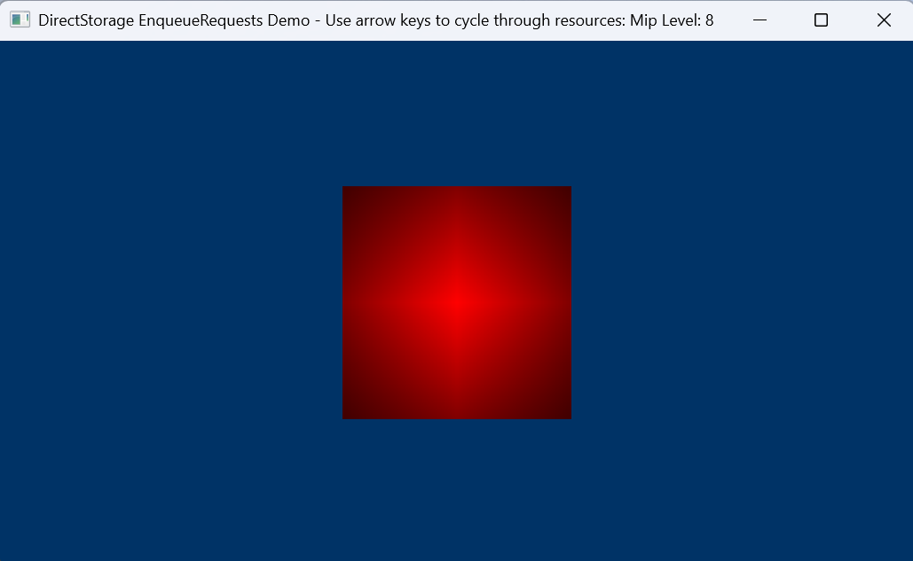

# EnqueueRequestsDemo


This sample demonstrates the use of `EnqueueRequests()` and the destination type
`DSTORAGE_REQUEST_DESTINATION_MULTIPLE_SUBRESOURCES_RANGE`. In this demo, a quad
is textured with a reserved (tiled) resource containing a full mip chain. The
currently visible mip level is mapped and unmapped to the reserved resource on
demand. You can change the visible mip by pressing the arrow keys.

The sample synchronizes the execution of
`ID3D12CommandQueue::UpdateTileMappings()` with requests enqueued on the
DirectStorage queue using the new `EnqueueRequests()` API. This ensures that the
reserved resource is not written to until the tile locations are mapped to
memory locations in a resource heap. The sample also demonstrates the new
DirectStorage request destination type,
`DSTORAGE_REQUEST_DESTINATION_MULTIPLE_SUBRESOURCES_RANGE`, which allows a
specific range of subresources to be written to.

This demo is based on the [D3D12ReservedResources sample](https://github.com/microsoft/DirectX-Graphics-Samples/tree/master/Samples/Desktop/D3D12ReservedResources).

# Build
Install [Visual Studio](http://www.visualstudio.com/downloads) or higher.

Open the following Visual Studio solution and build
```
Samples\EnqueueRequestsDemo\EnqueueRequestsDemo.sln
```

# Usage
Example usage
```
Samples\EnqueueRequestsDemo\bin\x64\Debug\EnqueueRequestsDemo.exe
```

## Related links
* https://aka.ms/directstorage
* [DirectX Landing Page](https://devblogs.microsoft.com/directx/landing-page/)
* [Discord server](http://discord.gg/directx)
* [PIX on Windows](https://devblogs.microsoft.com/pix/documentation/)